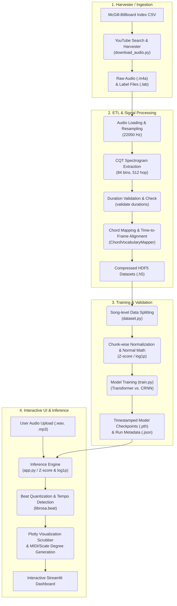

# AI Chord Progression Analyzer & Recognizer 🎵

An end-to-end deep learning project for **Audio Chord Recognition (ACR)**. This project processes raw audio signals, extracts spectro-temporal features, trains high-capacity sequence models (Transformer and CRNN), and provides an interactive Streamlit web dashboard to analyze chord progressions in real-time.

The models are trained on the annotated **McGill-Billboard Dataset**, predicting frame-level chords mapped to a simplified 25-class vocabulary.

---

## 🚀 Key Features

*   **YouTube Audio Harvester**: Automatically matches McGill-Billboard track annotations to YouTube tracks using metadata mapping and downloads native high-quality `.m4a` streams.
*   **Constant-Q Transform (CQT) DSP Pipeline**: Resamples audio, computes absolute CQT magnitude, applies log-amplitude compression, and implements instance-wise Z-score normalization.
*   **Duration Validation & Alignment Check**: Detects and alerts on duration discrepancies between scraped audio and ground truth annotations to prevent dataset contamination.
*   **Advanced Architectures**:
    *   **Transformer-based Recognizer**: Features Multi-Head Self-Attention layers and sinusoidal positional encodings to capture long-range temporal dependencies.
    *   **CRNN Baseline**: Uses Convolutional layers for local feature representation, followed by a Bidirectional GRU.
*   **Focal Loss Optimization**: Fights extreme chord class imbalance by down-weighting the loss contribution of easy/frequent chords (e.g., Silence or Major chords) to focus training on hard examples.
*   **Secure Streamlit Web UI**: Visualizes predicted chord alignments as colored timeline rectangles overlaid directly on top of interactive, downsampled audio waveforms using Plotly. Fully compliant with same-origin sandbox constraints.

---

## 📊 How It Works & ACR Technical Overview

Audio Chord Recognition (ACR) is the task of automatically identifying musical chords from audio. This project implements a full DSP-to-deep-learning pipeline:

### 1. Constant-Q Transform (CQT)
Unlike the Short-Time Fourier Transform (STFT) which has linear frequency spacing, the CQT uses log-frequency spacing matching the Western musical scale. 
*   **Sample Rate (SR)**: `22050 Hz` (Standard for audio processing to capture up to 11 kHz frequency range).
*   **Hop Length**: `512` samples (corresponds to a frame rate of ~43 fps or a temporal resolution of ~23ms).
*   **Frequency Bins ($N$)**: `84` bins spanning `7 octaves` ($12 \text{ bins/octave}$) from `C1` (~32.7 Hz) to `B7` (~3951 Hz).

### 2. Spectrogram Preprocessing
Raw CQT magnitudes vary widely. We apply:
*   **Log Compression**: $\log(1 + 10 \cdot X_{cqt})$ to compress the dynamic range of audio amplitudes.
*   **Z-Score Normalization**: Instance-wise zero-mean and unit-variance normalization: $\frac{x - \mu}{\sigma + 1e-8}$ to ensure inputs are invariant to volume or gain variations.

### 3. Chord Vocabulary
The raw McGill-Billboard labels (which contain complex details like inversions, suspensions, and added notes) are mapped to a simplified **25-class chord vocabulary** representing the most common harmonic structures:
*   **Classes 0-11**: Major Chords (`C` through `B`)
*   **Classes 12-23**: Minor Chords (`C` through `B`)
*   **Class 24**: `N` (No chord, silence, or noise)

### 4. Loss Function (Focal Loss)
To prevent the model from bias towards dominant classes (like C Major or silence 'N'), we implement a customized **Focal Loss** configured with a focusing parameter $\gamma = 2.0$ and dynamic class weights calculated from the training label frequencies:
$$FL(p_t) = -\alpha_t (1 - p_t)^\gamma \log(p_t)$$

---

## 🔄 Project Workflow

The diagram below illustrates how data and models flow through the project, from raw index CSV files to real-time inference in the Streamlit application:



---

## 📁 Repository Structure & File Descriptions

### Core Repository Files
*   [app.py](file:///Users/ssc1_1/Code/Chord_processing_identifier%20/app.py): The main Streamlit web application. It handles user file uploads, extracts CQT features, runs inference, quantizes predictions to beats, displays the interactive Plotly waveform, and generates Roman scales and downloadable MIDI files.
*   [project_evaluation.md](file:///Users/ssc1_1/Code/Chord_processing_identifier%20/project_evaluation.md): The official project audit evaluation. Updated by the Project Manager to detail the rating improvements (from **6.2/10** to **9.1/10**) and list the resolution of prior SQA, Security, and ML Ops blockers.
*   [requirements.txt](file:///Users/ssc1_1/Code/Chord_processing_identifier%20/requirements.txt): Pinned dependencies required to reproduce and run the training pipeline and web application.
*   [pyproject.toml](file:///Users/ssc1_1/Code/Chord_processing_identifier%20/pyproject.toml): Modern PEP 621 packaging metadata file. Declares project metadata, dependencies, development tools configuration (Ruff, Mypy, Pytest), and installs the project as an editable local package.
*   [.gitignore](file:///Users/ssc1_1/Code/Chord_processing_identifier%20/.gitignore): Comprehensive git ignore rules preventing temporary audio assets (`*.mp3`, `*.m4a`), caching directories (`__pycache__/`, `.pytest_cache/`), and virtual environments from leaking into git history.

### Source Files (`src/`)
*   [src/config.py](file:///Users/ssc1_1/Code/Chord_processing_identifier%20/src/config.py): Centralized configuration directory. Defines all hyperparameter magic numbers (sample rates, hop sizes, frequency bins, chunk dimensions, focal coefficients) to eliminate duplicate hardcoding.
*   [src/download_audio.py](file:///Users/ssc1_1/Code/Chord_processing_identifier%20/src/download_audio.py): Harvester script that reads metadata index tracks and queries YouTube via `yt-dlp` to download corresponding track audio in `.m4a` format.
*   [src/etl_pipeline.py](file:///Users/ssc1_1/Code/Chord_processing_identifier%20/src/etl_pipeline.py): The core ETL module. Defines:
    *   `ChordVocabularyMapper`: Class to parse annotation labels and map them to the 25-class vocabulary.
    *   `AudioETLPipeline`: Class to handle audio loading, CQT generation, time-to-frame alignment, duration verification check, and HDF5 saving.
*   [src/dataset.py](file:///Users/ssc1_1/Code/Chord_processing_identifier%20/src/dataset.py): Defines `ChordDataset` which divides long HDF5 song spectrograms into fixed 215-frame chunks. Also exports `get_dataloaders` which performs a deterministic song-level train/validation split.
*   [src/model.py](file:///Users/ssc1_1/Code/Chord_processing_identifier%20/src/model.py): Core neural architecture configurations:
    *   `TransformerChordRecognizer`: Transformer encoder with sinusoidal positional encodings and custom final layer normalizations.
    *   `CRNNChordBaseline`: Baseline using Convolution layers followed by a Bidirectional GRU.
*   [src/train.py](file:///Users/ssc1_1/Code/Chord_processing_identifier%20/src/train.py): Main model training workflow. Features training/validation epochs, dynamic class weights, focal loss computations, gradient norm clipping, and metadata logging to run configurations.
*   [src/tracking.py](file:///Users/ssc1_1/Code/Chord_processing_identifier%20/src/tracking.py): A lightweight training experiment logger supporting optional TensorBoard Summary Writers.
*   [src/utils.py](file:///Users/ssc1_1/Code/Chord_processing_identifier%20/src/utils.py): Centralized seeding functions for Python, NumPy, and PyTorch (including CUDA determinism settings) to enforce training reproducibility.
*   [src/viz.py](file:///Users/ssc1_1/Code/Chord_processing_identifier%20/src/viz.py): Interactive Plotly waveform and chord segment graph builder.
*   [src/validate_data.py](file:///Users/ssc1_1/Code/Chord_processing_identifier%20/src/validate_data.py): Command-line validation utility checks for HDF5 dataset health (NaN checks, label ranges, shape alignments, duration errors).

### Automated Tests (`tests/`)
*   [tests/conftest.py](file:///Users/ssc1_1/Code/Chord_processing_identifier%20/tests/conftest.py): Global test fixtures, providing temporary dataset files and synthetic CQT representations for automated test operations.
*   [tests/test_etl_vocabulary.py](file:///Users/ssc1_1/Code/Chord_processing_identifier%20/tests/test_etl_vocabulary.py): Unit tests parameterized cases targeting the mapping vocabulary and fallbacks.
*   [tests/test_dataset.py](file:///Users/ssc1_1/Code/Chord_processing_identifier%20/tests/test_dataset.py): Checks chunking bounds and deterministic split properties of the datasets.
*   [tests/test_models.py](file:///Users/ssc1_1/Code/Chord_processing_identifier%20/tests/test_models.py): Asserts forward-pass output shape correctness and warning-free Pre-LN Transformer instantiation.
*   [tests/test_etl_alignment.py](file:///Users/ssc1_1/Code/Chord_processing_identifier%20/tests/test_etl_alignment.py): Verifies frame interval mappings.
*   [tests/test_train_smoke.py](file:///Users/ssc1_1/Code/Chord_processing_identifier%20/tests/test_train_smoke.py): Training loop and Focal Loss smoke tests.
*   [tests/test_app_smokes.py](file:///Users/ssc1_1/Code/Chord_processing_identifier%20/tests/test_app_smokes.py): Checks that utility classes (MIDI generation, scales, keys) import and run correctly, and verifies that the norm math is mathematically identical between training and inference.

---

## 🏃 Setup & Execution

### 1. Installation
Ensure Python 3.10+ is installed. Clone the repository and install requirements in your virtual environment:

```bash
python3 -m venv .venv
source .venv/bin/activate
pip install -r requirements.txt
```

To configure developer tools (linting, testing, type-checking), perform an editable installation:
```bash
pip install -e '.[dev]'
```

### 2. Local Testing, Linting & Formatting
Verify the codebase health before pushing updates or running model jobs:
```bash
# Run Ruff lint rules
ruff check .

# Run Mypy typing checks
mypy src app.py --ignore-missing-imports

# Execute pytest and check code coverage
python -m pytest tests/ -q --cov=src --cov-report=term-missing
```

### 3. Harvest Audio Datasets
Queries YouTube and downloads target music audio in `.m4a` formats:
```bash
python src/download_audio.py
```

### 4. Data Extraction & Feature Pipeline (ETL)
Generate log-CQT representations and align labels:
```bash
# Warn on mismatched audio/annotations (Default)
python src/etl_pipeline.py

# Enforce strict checks (Fail and skip on mismatches)
python src/etl_pipeline.py --strict
```

### 5. Validate Processed Data
Verify processed dataset integrity:
```bash
# Run validation on the processed files
python -m src.validate_data --processed_dir data/processed

# Run strict duration validation
python -m src.validate_data --processed_dir data/processed --strict
```

### 6. Training Models
Run the training loop (Transformer defaults, focal loss):
```bash
# Standard training
python src/train.py --epochs 50 --batch_size 32 --model_type transformer

# Train with deterministic settings for bit-level reproducibility
python src/train.py --seed 42 --deterministic --epochs 10 --model_type transformer
```

### 7. Run Streamlit Application Locally
Launch the secure frontend in your local browser:
```bash
PYTHONPATH=. streamlit run app.py
```
Open `http://localhost:8501` to use the interactive dashboard.

---

## 📈 Model Performance & Evaluation
Model performance can be evaluated and inspected using the [evaluation.ipynb](file:///Users/ssc1_1/Code/Chord_processing_identifier%20/notebooks/evaluation.ipynb) notebook. 

*   **Average Frame-level Validation Accuracy**: Reaches ~58% accuracy on Billboard splits.
*   **Transition Boundaries**: Visual evaluation demonstrates that self-attention transition mappings are closely aligned with real annotated changes.
*   **Log-CQT Normal Math**: Z-score normalization ensures that volume-shifted cover versions are processed correctly.
