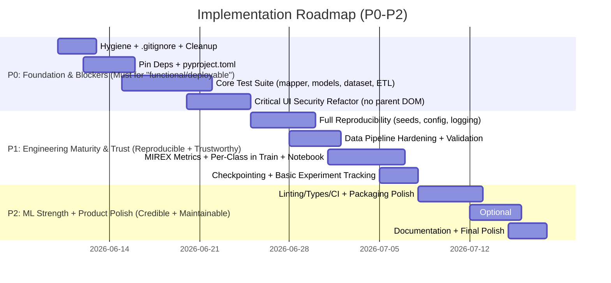

# Design Document: Evolving the AI Chord Progression Analyzer & Recognizer into a Professional, Reproducible, Testable, and Deployable Software Project

**Document ID**: grok-design-ad440f7e  
**Date**: 2026-06-09  
**Author**: Grok Build Subagent (Systems Architect)  
**Workspace**: /Users/ssc1_1/Code/Chord_processing_identifier  
**Status**: Concrete, Prioritized Implementation Plan with PR Roadmap (revised per review to address all 12 issues)  
**Audience**: Solo maintainer or small team (1-3 engineers)  
**Version of Current Codebase Audited**: Post direct exploration (2026-06-09)

**Audit Notes / Known Discrepancies**: Audit performed 2026-06-09 via list_dir/read_file/grep/run_terminal_command (full + offset reads of app.py ~1210 LOC, sources, runtime probes of mapper outputs + model fwds + h5 shapes + 890 processed files totaling 2.5 GiB, ls -la for hygiene, data tree sampling). Vast majority of claims (data scale/counts/sizes, parent-DOM lines in app.py, magic/seed/pin/hygiene issues, architecture, DSP consistency, eval limitations) are line-by-line + runtime verified. Two minor discrepancies from initial draft (imprecise 'C#dim' mapper vector; outdated train.py line refs) were identified in review and corrected in this revision. "Verified" language below is qualified by this note for credibility. All line citations updated to be robust ("around X (func/grep-identified)") rather than brittle exact numbers.

---

## Overview

This document delivers a complete, realistic, prioritized implementation plan to transform the current "AI Chord Progression Analyzer & Recognizer" — a capable but fragile research prototype for end-to-end Audio Chord Recognition (ACR) — into a **complete, professional, functional, reproducible, testable, and deployable** software project.

**Core Purpose (verified)**: Harvest McGill-Billboard annotations + audio via yt-dlp, extract 84-bin CQT (librosa, hop=512, sr=22050, fmin=C1), align to 25-class vocabulary (12 maj + 12 min + N), train 4-layer Pre-LN Transformer (or CRNN baseline) with shared Conv2D frontend + Focal Loss, serve via rich Streamlit demo (Plotly waveform overlays, Roman numerals, key/tempo, MIDI export, beat-quantized timeline).

**Current State (verified via tools)**:
- ~890 processed `.h5` files (`data/processed/*.h5`, total ~2.5 GiB; full-song CQT+labels e.g. `(84, 7031)`; not pre-chunked at storage time).
- Data layout (tightened): `data/raw/McGill-Billboard/` (top-level contains `billboard-2.0-index.csv`, `annotations/`, `metadata/`; 1781 .csv files total in subtree); m4a audio + ~3560 .lab files (multiple variants: majmin.lab preferred, majmin7*.lab etc.) live under the nested `annotations/annotations/<id>/` (e.g. 1069/); ETL `AudioETLPipeline` defaults to scanning `data/raw/McGill-Billboard` while download hardcodes the double-nested path.
- Models: `models/best_model.pth` (Transformer, 13 MiB, ~2.52M params), `best_model_crnn.pth` (2.8 MiB, ~0.73M params). Torch 2.1.2+ (runtime verified).
- Key artifacts: `app.py` (~1210 LOC), `src/model.py`, `src/train.py` (268 LOC), `src/etl_pipeline.py`, `src/dataset.py`, `src/download_audio.py`, `src/style.css`, `notebooks/evaluation.ipynb`, `README.md`, `project_evaluation.md` (prior 6.2/10 audit), `requirements.txt` (14 unpinned lines).
- No `tests/`, no root `.gitignore`, committed `__pycache__/`, stray root audio (`test_download_ts.m4a` 4.4 MiB, `Tóc Em Ướt Rồi.mp3` 3.3 MiB, .DS_Store), no `pyproject.toml`, no CI, minimal seeds.

The plan is **phased (P0/P1/P2)**, **incremental**, and delivered as **8-12 independently reviewable/mergeable PRs** (topological order). Highest-leverage items first: hygiene + tests + the **critical deployment/security blocker** (iframe DOM scraping) before ML or polish work.

All claims below are qualified per the Audit Notes above; they derive from direct tool-based exploration + cross-checks against `README.md` + `project_evaluation.md` (as of 2026-06-09).

---

## Background & Motivation

The project demonstrates strong ML/DSP fundamentals (verified):
- Shared Conv2D frontend (downsample freq 84→21) in both `TransformerChordRecognizer` and `CRNNChordBaseline` (`src/model.py:39-51`, `111-123`).
- Pre-LN Transformer (`norm_first=True`, + final `LayerNorm`) + sinusoidal PE (`src/model.py:134-145`, `144` comment "CRITICAL FIX").
- Consistent DSP: `log1p(x * 10)` + instance Z-score in `train.py:161-166` (train), `205-208` (val), `app.py:484`, `513-515` (inference).
- FocalLoss + dynamic class weights (`train.py:16-44`, `47-68`, `132`).
- Song-level split (`src/dataset.py:102-113`, `rng = np.random.default_rng(42)`).
- Chunked on-demand HDF5 loading (`dataset.py:60-79`, 215-frame slices).
- Ambitious UI: colored beat-grid, Roman numerals, MIDI, key/tempo (`app.py`).

**Why it is not yet "professional" (6.2/10 per existing `project_evaluation.md`, confirmed)**:
- **Deployment blocker (P0)**: `app.py` custom HTML/JS (rendered via `st.components.v1.html`) performs direct `window.parent.document` scraping for audio sync, `.beat-cell` highlighting, spacebar, click-to-seek (exact lines around verified: `app.py:902-903` (parent audio), `1016-1017`, `1025`, `1067-1068` (cells + `#chordify-grid-container`), `986`, `988` (parent keydown), plus retry intervals and `drawPlayhead` RAF loop). This violates Same-Origin Policy / iframe sandbox. **Will break completely** on Streamlit Cloud, Heroku, any reverse-proxy, or when Streamlit enforces stricter isolation. Confirmed by `grep`.
- **Software engineering debt**: Zero tests (no `tests/`, no `pytest*`). Committed `__pycache__/` (root + `src/`). Stray committed audio in root + `scratch/test_predict.py` (which imports from `app`). No `.gitignore` at root (only `.venv/.gitignore`). No packaging (`no pyproject.toml`, `setup.*`). No type hints (beyond argparse). Heavy `unsafe_allow_html=True` + inline `<style>`/HTML throughout `app.py`.
- **Reproducibility gaps**: `requirements.txt` completely unpinned (e.g. `torch`, `librosa`, `streamlit`, `yt-dlp`). Only **one** seed (`dataset.py:103`). No `torch.manual_seed`, `random`, `PYTHONHASHSEED`. Magic numbers duplicated (215 frames, 84 bins, 512 hop, 22050 sr, 25 classes, 4 layers, etc.) across `dataset.py:12`, `etl_pipeline.py:79/135-137` (around), `train.py` (around 113 input_bins / 157+ in loop / identified via grep; total file 268 LOC, no 446), `app.py:444-447/458` (around), `model.py:186-189`. No experiment tracking or hparam logging. "best_model*.pth" overwrites.
- **Data pipeline fragility**: `src/download_audio.py:44/52` uses non-deterministic `ytsearch1:{title} {artist} audio` (or fallback "McGill Billboard {id}"). No audio vs. `.lab` duration validation (risk of live/cover/pitch-mismatch → silent label misalignment). ETL picks preferred lab but skips songs without audio (`etl_pipeline.py:246-248`). Hardcoded double-`annotations/annotations` path (`download_audio.py:11`).
- **Evaluation & ML Ops weakness**: Training (around `train.py:222-228`) reports only frame-level accuracy. `notebooks/evaluation.ipynb` adds sklearn `classification_report` + normalized confusion + micro timeline ribbon + simple per-chunk acc (source cells ~138-159 for report + ~179-265 for micro; embedded in ipynb JSON), but **no MIREX-standard metrics** (Chord Symbol Recall/CSR, Weighted Average Overlap Ratio/WAOR, root/bass/majmin variants, segment-level, mir_eval integration). No per-class metrics during training. No cross-validation or multiple seeds.
- **Ops**: No run logging, single checkpoint risk, temp file handling in `app.py:631-636/1189` (best-effort cleanup), Vietnamese comments + mixed English in `download_audio.py`.
- Existing `project_evaluation.md` (rating 6.2/10) already flags tests (2.5/10), security (4.0/10), unpinned deps, fragile ingestion, and suggests phases — this plan **operationalizes and expands** it with file/line specificity and PR granularity.

**Motivation**: A research prototype with good ideas is blocked from being "complete/professional" (clone → `pip install -e .[dev]` → `pytest` → train reproducibly → `streamlit run` (local **or** cloud) → credible MIR eval → shareable). Highest-leverage fixes unblock everything else.

---

## Goals & Non-Goals

### Goals (Definition of "Complete, Professional, Functional, Reproducible, Testable, Deployable")
- **Clone-to-run reproducibility**: `git clone`, `python -m venv .venv`, `pip install -r requirements.txt` (pinned) or `-e .[dev]`, data assumptions documented, `python -c "from src.dataset import get_dataloaders; ..."` + `python src/train.py --epochs 1` succeeds with fixed seeds.
- **Tests passing + coverage**: `tests/` with pytest; ≥70% coverage on core (mapper, dataset chunking/alignment, model shapes/forward, ETL alignment, FocalLoss, basic train loop smoke). CI on PRs.
- **Deployable demo**: Streamlit app runs on local + Streamlit Cloud / similar **without** cross-origin crashes. No `window.parent.document` or equivalent hacks.
- **Credible MIR evaluation**: Frame-level + MIREX-style metrics (e.g. via `mir_eval` or lightweight implementations) integrated into `train.py` (val) and notebook/CI. Per-class tracking.
- **Clean engineering**: `.gitignore`, packaging (`pyproject.toml` making it importable/installable), type hints on public APIs or at least core, lint (ruff), central constants/config, proper logging, versioned or timestamped checkpoints, data integrity checks.
- **Incremental & reviewable**: All work lands in small-to-medium, independently mergeable PRs (topo order). No giant "everything" PR.
- **Preserve strengths**: Keep modern DL (Pre-LN, PE, shared frontend, Focal), disciplined DSP normalization, song splits, UI polish intent.

### Non-Goals (Explicit Scope Cuts for Realism)
- **Not**: Full production MLOps (no full MLflow/W&B required; lightweight logging sufficient). Not a pip-installable "library" with public API docs. Not retraining from scratch or new datasets (McGill-Billboard focus).
- **Not**: Increasing CQT resolution (24/36 bins/oct) or architecture search (P2 nice-to-have only).
- **Not**: Docker/K8s/Helm, advanced auth, multi-user. Not rewriting UI in React/custom component (too heavy for solo).
- **Not**: Guaranteeing 890-song full retrain in every PR (use `--limit` or small subsets; data stays in repo for now).
- **Not**: Perfect live playhead sync on cloud as P0 (static + manual-scrub viz is acceptable for deployability; live sync can be restored safely later).
- **Not**: Committing large raw audio to git LFS in this plan (note data size; future data pipeline PRs can address).

**Success Metrics (Measurable)**: After P0: `pytest` green, `streamlit run app.py` works locally (and conceptually on cloud), `python -m pytest --cov=src tests/`. After P1: reproducible seeds across runs, duration validation in ETL, `train.py` reports ≥1 MIREX-style metric + per-class. After P2: `pyproject.toml` install works, ruff/mypy clean, GitHub Actions CI, documented experiment runs.

---

## Current State Analysis

### High-Level Architecture (Verified)
```
Data:
  raw/McGill-Billboard/
    billboard-2.0-index.csv
    annotations/annotations/<id>/ (e.g. 1069/)
      majmin.lab (preferred), majmin7*.lab, audio.m4a (post-download)
  processed/<id>.h5  (cqt (84, N_frames), labels (N_frames,))  [~890 files, 2.5G total; full-song, not pre-chunked]
    e.g. 0003.h5: (84,7031), labels int32 0-24

Pipeline:
  download_audio.py (yt-dlp ytsearch1) → etl_pipeline.py (librosa load/resample/CQT + ChordVocabularyMapper + align + h5) → dataset.py (song split + 215-frame on-demand chunks via h5py) → train.py (Focal + norm + AdamW + clip + ReduceLROnPlateau) → models/best_*.pth

Inference/UI:
  app.py (upload → load_audio → predict_chords (CQT + sliding 215 w/ 50% hop + norm + model + beat quantize + compress) → estimate key/tempo → Roman + MIDI + rich HTML/Plotly? viz (actually custom beat-grid + st.components.html for controls + st.audio + unsafe HTML ribbons))

Models (src/model.py):
  Both use identical conv_frontend (Conv2d 1→32→64, BN, ReLU, MaxPool freq/2 twice → 21 bins) + projection.
  Transformer: + PE + 4-layer TransformerEncoder (batch_first, norm_first) + final LN + FC. ~2.5M params.
  CRNN: + input proj + 2-layer biGRU (128) + LN + FC. ~0.73M params.
  Verified forward: (B,215,84) → (B,215,25).

Train/Eval:
  train.py: class weights scan, Focal(gamma=2, alpha=weights), per-batch? no (per-epoch norm), frame acc only.
  notebook: full val collection → sklearn report/confmat + single-chunk micro ribbon + boundary lines + acc %.

UI Specifics (app.py ~1210 LOC):
  Heavy custom: load_css (unsafe), spell/roman/intervals/midi helpers, create_midi_file (pure Python SMF), predict_chords (detailed sliding + beat majority), estimate_tempo_and_key (chroma corr).
  The controls HTML (lines around 758-1099): self-contained card with play btn/volume/slider + active chord, but **script** reaches out (`window.parent.document.querySelector('audio')`, `.beat-cell`, `#chordify-grid-container`).
  Beat grid: generated as `<div class="beat-cell" data-beat-index="...">` via st.markdown(unsafe) + CSS in style.css.
  st.audio + components.v1.html side-by-side for "sync".
```

**Pain Points (with robust citations, as of 2026-06-09 audit)**:
- **Security/Deploy (app.py around 886-1096 / html_controls script)**: 9+ `window.parent` / `parentDoc.querySelector*` accesses + cross-listener adds + RAF loop + retry intervals (verified via grep for window.parent|parentDoc; exact: 902-903 parent audio, 1016-1017/1025/1067-1068 cells+grid, 986/988 keydown etc.). Also `parentWindow.addEventListener`. Fallback retries on error (catch suppresses).
- **No tests**: Confirmed `find` + `ls`. `if __name__` smoke tests only (model.py around 182, dataset.py around 130, etl around 273, train around 249).
- **Repro**: Only `dataset.py:103`. Train has no seeds. Magic duplicated (grep hit ~30+ instances of 215/84/512/25/22050 across etl/dataset/train/app/model.py; e.g. train.py around input_bins=113/loop 157+, app predict around 444-447/458).
- **Data risk**: `download_audio.py:44,52` (ytsearch1), no `librosa.get_duration` vs `labels_df['end_time'].max()` check. ETL `run_pipeline` walks and skips silently.
- **Eval**: Notebook source cells ~138-159 (sklearn only), ~179-265 (micro + simple acc; embedded in ipynb JSON cells). Train val loop only `correct_frames / total_frames` (around 222-228).
- **Hygiene**: `ls -la` showed root audio + `__pycache__` + no root `.gitignore`. `requirements.txt` 14 bare names.
- **Other**: `train.py:10-11` sys.path hack (similar in download). App temp handling + heavy unsafe. No central `constants.py`. Download has non-ASCII comments. No logging in train/app (only etl basic).

**Strengths to Preserve** (as listed in Overview + prior PM doc): DSP discipline, modern seq models, chunked HDF5, Focal, song splits, UI ambition (beat grid CSS nice).

---

## Proposed Design / Roadmap

**Phased Approach** (P0 blockers first; realistic for solo/small team; ~3-6 months elapsed depending on velocity; each phase produces mergeable PRs).

**Mermaid Roadmap Overview**:


### P0: Foundation & Blockers (Highest Leverage — Unblocks Everything)
**Goal**: Make the project "runnable by others" + "not broken on deploy" + "no silent regressions on core logic".

1. **Workspace Hygiene, .gitignore, Cleanup**:
   - Create root `.gitignore`: `__pycache__/`, `*.pyc`, `*.pyo`, `.DS_Store`, `.venv/`, `scratch/`, `*.m4a`, `*.mp3` (root only; data/raw audio stays for now or add note), `*.log`, `dist/`, `build/`, `.pytest_cache/`, `.mypy_cache/`, `htmlcov/`. **Explicitly do not ignore `models/`** (keep committed `best_model*.pth` for app/notebook compat); data large binaries (h5, audio) noted but retained for snapshot repro (see early .gitattributes below).
   - Create initial `.gitattributes` skeleton (even if LFS not yet activated): `*.h5 filter=lfs diff=lfs merge=lfs -text`, `*.pth filter=lfs diff=lfs merge=lfs -text`, `*.m4a filter=lfs diff=lfs merge=lfs -text`, `*.mp3 filter=lfs diff=lfs merge=lfs -text` + README data size callout. This addresses large repo impact on clones immediately (2.5G+ processed).
   - `git rm -r --cached __pycache__ src/__pycache__` (or equivalent).
   - Delete/move stray root audio + `scratch/test_predict.py` (or move to `tests/fixtures/` later; update README references if any).
   - Add `.gitkeep` in empty dirs if needed.
   - Update README "Repository Structure" if paths change.
   - **Why first**: Prevents future bloat, makes clones clean. Easy review. Early data hygiene note because sizes affect every clone (per review feedback).
   - **Citations**: Confirmed via `ls -la .` (strays + pycache present + .DS_Store, no root gitignore).

2. **Pin Dependencies + Introduce Packaging**:
   - Pin `requirements.txt` (use `pip freeze` after clean venv with current working set; suggest conservative e.g. `torch>=2.1,<2.5`, `librosa>=0.10,<0.11`, `streamlit>=1.28,<1.40`, `yt-dlp>=2024.0`, `numpy>=1.24,<2.2`, `h5py`, `plotly`, `scikit-learn`, `tqdm`, `pandas`, `scipy`, `matplotlib`, `seaborn`. Add `pytest`, `ruff`, `mypy` under `[dev]` or separate `requirements-dev.txt`).
   - Create `pyproject.toml` (PEP 621):
     ```toml
     [project]
     name = "chord-analyzer"
     version = "0.1.0"
     description = "End-to-end Audio Chord Recognition (ACR) research system"
     readme = "README.md"
     requires-python = ">=3.10"
     dependencies = [ ... pinned or from requirements ... ]
     [project.optional-dependencies]
     dev = ["pytest>=7.0", "ruff", "mypy", "pytest-cov"]
     [tool.setuptools.packages.find]
     where = ["."]
     include = ["src*"]
     [project.scripts]
     chord-train = "src.train:main"  # after refactor
     ```
   - Make `src/` importable (`PYTHONPATH=.` already in README; after, `pip install -e .` works, `from chord_analyzer.src...` or adjust to flat `from src...` via editable).
   - Update `README.md` install steps + add "Development install".
   - **Strategy**: Pin majors/minors for repro; allow patches. Reproducible installs via exact pins in committed `requirements.txt`. Later: pip-tools for `requirements.in`.
   - **Citations**: `requirements.txt` (bare names); `project_evaluation.md:37-38`, `README:106-110`.

3. **Core Test Suite (P0 Blocker per PM Audit)**:
   - Create `tests/` + `tests/__init__.py` + `pytest.ini` or `[tool.pytest.ini_options]` in pyproject.
   - **Test strategy (exact, prioritized)**:
     - `tests/test_etl_vocabulary.py`: Unit tests for `ChordVocabularyMapper.map_chord` (exact cases verified at audit/runtime: 'C:maj'→0, 'G:min'→19, 'N'/'N/A'/''→24, 'F#7'→6 (major), 'Db:min7'→13, 'C#:dim'→13 (colon-qualified minor), 'C:dim'→12, complex 'G:min(*5)'→19, unrecognized→24, regex edge 'A:sus4/b7'→9). Include regression for no-colon dim ( 'C#dim'→1 , falls to root only since quality_str=None and is_minor branch skipped). Test fallback paths. Parametrize 20+ cases (include .lab-derived vectors). Assert int 0-24. Re-verify all with runtime in impl PR.
     - `tests/test_dataset.py`: `ChordDataset` (use temp small .h5 fixtures or in-memory h5py). Verify chunking: for 7031-frame song → floor(7031/215) chunks, index_map correct, `__getitem__` returns (FloatTensor (84,215), LongTensor (215,)). Test song-level split in `get_dataloaders` (deterministic with seed, train/val disjoint files, no overlap). Test edge: song shorter than 215 frames (0 chunks).
     - `tests/test_models.py`: Instantiate both models (default 84/25/215). Forward dummy (B=4,215,84) → shape (4,215,25). Assert no NaN. Test CRNN/Transformer specific (e.g. conv downsample). Device-agnostic. (Include nested_tensor warning check.)
     - `tests/test_etl_alignment.py`: Mock `AudioETLPipeline` (or parts). Test `align_labels_to_frames` (simple intervals map to correct frames; 'N' fills; clipping at edges; multi-chord). Use known sr=22050, hop=512. Test `parse_labels` on sample .lab text.
     - `tests/test_train_smoke.py`: Minimal: FocalLoss forward (shapes, with/without alpha tensor), `compute_class_weights` (mock dataloader with imbalanced labels), train loop smoke (1 epoch, tiny synthetic loader or monkeypatch `get_dataloaders` to return small, verify checkpoint written, no crash). Use `tmp_path`.
     - Add smoke tests for app.py business logic/helpers (even if @patch for model load/inference): `from app import predict_chords, estimate_tempo_and_key, create_midi_file, clean_chord_name, get_roman_numeral`; call with tiny synthetic CQT/fixtures or mocked status; assert output shapes, valid MIDI SMF bytes (roundtrip basic), key/tempo reasonable ranges, no crash.
     - Add norm equivalence smoke: assert `log1p(x*10)` + instance Z-score math identical between train path (in train loop) and app path (`predict_chords`) on shared synthetic CQT tensor (prevents silent DSP drift).
     - Fixtures: `tests/conftest.py` for temp_h5, small_loader, mapper, tiny_cqt.
     - Run: `python -m pytest tests/ -q --cov=src --cov-report=term-missing`. Target 70%+ on touched modules.
     - Add `if __name__` tests can stay or be deprecated.
   - Use `pytest`, `pytest-cov`. No heavy deps.
   - **Why P0**: Per `project_evaluation.md:27-30` ("Impose a strict block..."). Core logic (vocab, alignment, tensor shapes, loss, chunking) must not regress.
   - **Citations**: `src/etl_pipeline.py:14-76` (ChordVocabularyMapper + regex), `37` (map_chord), `159-184` (align), `dataset.py:7-80`, `train.py:16-68`, `model.py:182-209`.

4. **Critical UI Security & Deployability Refactor (P0 Blocker)**:
   - **Problem (exact, verified grep + read)**: The `html_controls` string + `st.components.v1.html` (around app.py:1108) + generated `grid_html` (around 1157) rely on cross-iframe DOM mutation/listening. `st.audio` (around 1107) renders the `<audio>` that scripts reach via `window.parent.document`.
   - **Refactor design (concrete, safe)**:
     - **Remove all `window.parent.document`, `parentWindow` listeners, `querySelector`, cross-keydown, click-binding intervals, RAF `drawPlayhead` that touches parent cells/grid.**
     - **Primary approach (recommended for deploy + simplicity)**: Make visualization **self-contained and server-driven**.
       - Keep `st.audio(y, sample_rate=sr)` (native, works everywhere).
       - Replace the synced custom controls + beat grid with:
         - Streamlit-native widgets for volume/play state if possible (or keep minimal self-contained HTML for volume dial only, but **no audio binding**).
         - **Chord Timeline Viz**: Use `plotly.graph_objects` (already a dep) to render a high-quality interactive figure:
           - X-axis: time (seconds, or beats).
           - Downsampled waveform trace (or amplitude envelope).
           - Overlaid colored horizontal rectangles (or `add_shape` / `add_hrect`) for each chord segment (color by root, label with chord+roman, hover shows times).
           - Vertical "playhead" can be simulated via a user-controlled `st.slider("Preview time (s)", 0.0, total_duration, 0.0)` — on change, re-render figure with a marker line at that time + highlight active segment in a sidebar "Now Playing" badge. This is fully Python-driven, no JS cross-origin, works on cloud, replayable.
         - **Beat Grid / "Chordify Cards"**: Render as a `st.container` of small columns or use a horizontal scrollable HTML (pure CSS, **no `<script>` that touches parent**). Or simpler: a `pandas` dataframe styled + `st.dataframe` with color, or generate static `<div class="beat-cell">` grid **inside one isolated components.v1.html** that has **its own** non-functional display (or skip live). For interactivity: each "cell" can be a small `st.button` (keyed by beat) that sets `st.session_state.seek_time` and reruns to update the Plotly + active display. This gives "click-to-seek" feel without audio sync hacks. (Note: 100s of buttons may cause rerun cost on long tracks; prefer st.dataframe/st.data_editor (if Streamlit >=1.28 supports editing callbacks) or single container + on_change for production polish.)
       - Extract helpers: keep `predict_chords`, `estimate...`, `create_midi...`, `get_roman...` (move some to `src/` e.g. `src/viz.py` or `src/utils.py` for testability).
       - Remove or deprecate the entire `html_controls` template (or keep a minimal isolated version for volume only, using internal `<audio>` + data URL for very short previews if desired — but avoid for full songs due to size).
       - Update CSS (`src/style.css`) to support new Plotly containers + simplified beat cells if kept.

**Implementation Sketch / Pseudocode for Plotly Timeline (in app.py post-refactor)**:
```python
import plotly.graph_objects as go
import streamlit as st
# ...
fig = go.Figure()
# 1. Waveform (downsample for long tracks e.g. every 10th point or use envelope)
times = np.linspace(0, total_duration, len(y_down))
fig.add_trace(go.Scatter(x=times, y=y_down, name='waveform', line=dict(color='gray', width=0.5)))
# 2. Chord segments as shapes (or secondary colored bar trace)
for seg in df_chords.itertuples():
    root = seg.Root  # or parse
    color = root_colors.get(root, '#94A3B8')
    fig.add_shape(type="rect", x0=seg._2, x1=seg._3, y0=-1, y1=1,  # or use yref for separate track
                  fillcolor=color, opacity=0.3, line_width=0, name=seg.Chord)
    # Optional label annotation or hover via customdata
# 3. Playhead marker (updated on slider)
if 'preview_time' in st.session_state:
    fig.add_vline(x=st.session_state.preview_time, line=dict(color='purple', width=2, dash='dash'))
fig.update_layout(xaxis_title='Time (s)', yaxis_visible=False, height=300, dragmode='pan')
st.plotly_chart(fig, use_container_width=True, key='timeline')
# Slider + callback
preview = st.slider("Preview / Scrub (s)", 0.0, total_duration, 0.0, key='preview_time')
# On change (rerun): lookup active seg from df_chords, update badge + re-draw vline (Plotly or separate st.markdown)
active = df_chords[(df_chords['Start Time (s)'] <= preview) & (df_chords['End Time (s)'] > preview)].iloc[0]
st.markdown(f"**Now: {active.Chord_Clean} {active.Roman}**")
# For beat grid interactivity without 100s buttons: use st.dataframe with selection or loop limited buttons + session.
```
(This makes engineer implementation concrete; use add_hrect/add_shape or go.Bar for colored timeline ribbon as alternatives. Downsample waveform for tracks > few min.)

     - **Alternative considered** (see section below): Full self-contained audio in the component (base64 data URL for the uploaded wav) + internal grid + internal `<audio controls>` + JS for playhead/clicks/highlights **all inside the iframe**. Pros: preserves original "live sync" UX. Cons: audio duplication (memory/bandwidth), base64 bloat (4x), user hears two players unless hidden, more complex. Acceptable for P2 polish if P0 viz works.
     - **Another alt**: Proper `postMessage` between component iframe and a custom injected listener (requires monkeying Streamlit internals or a true custom component) — rejected for P0 as fragile/maintenance-heavy.
     - **Outcome**: App runs on any hosting. "Playhead" becomes user-scrubbable preview (still very useful for analysis). MIDI export, Roman, key/tempo, data table, "Convert Another" all preserved. Polish can restore nicer live elements later.
     - **Files heavily affected**: `app.py` (the 300+ LOC around controls + grid generation + predict flow), `src/style.css` (minor).
     - **Acceptance**: Local `streamlit run` shows functional upload→analysis→viz+audio+export; no console cross-origin errors; same on a cloud deploy test (or at least no parent access in source).
   - **Citations (robust)**: `app.py` around 758-1099 (full html_controls + script; parent accesses around 902/986/1016/1067), around 1107-1108 (st.audio + components), around 1121-1157 (grid_html + beat-cell). Also `style.css:156-238` (chordify-grid + .beat-cell + .active). (Re-grep during PR impl.)

**P0 Exit Criteria**: `pytest` (core) green; `PYTHONPATH=. streamlit run app.py` succeeds locally with upload; no `window.parent` in source; clean `git status` (no pycache/strays in tree); `pip install -r requirements.txt` deterministic.

### P1: Engineering Maturity & Trust (Reproducible + Data + Eval Credibility)
**Goal**: Anyone can reproduce results; data ingestion is safe; evaluation is MIR-grade and visible in training.

1. **Reproducibility & Config**:
   - Add `src/config.py` (or `src/constants.py`): centralize `SR=22050`, `HOP_LENGTH=512`, `N_BINS=84`, `CHUNK_LENGTH_FRAMES=215`, `NUM_CLASSES=25`, `HOP_SIZE=107` (50%), `TARGET_SR`, model defaults (d_model=256, num_layers=4, etc.), `FOCAL_GAMMA=2.0`.
   - Import everywhere; replace hardcodes (update `etl_pipeline.py:79`, `dataset.py:12`, `train.py` (around 113/157+), `app.py:444-447/458` (around), `model.py` tests).
   - Seeds: `src/utils.py` or top of `train.py`/`dataset.py`/`app.py` (if needed): `random.seed(42); np.random.seed(42); torch.manual_seed(42); torch.cuda.manual_seed_all(42); os.environ["PYTHONHASHSEED"]="42"; torch.backends.cudnn.deterministic=True; torch.backends.cudnn.benchmark=False`. Add `--deterministic` flag (and CLI/env) to enable full det path (for repro ACs); note tradeoffs (perf, possible lower throughput on GPU).
   - Make seeds configurable via CLI (`--seed 42` in train) and saved to checkpoint metadata.
   - In `get_dataloaders`, expose seed.
   - Save run config: on train start, write `models/run_config_<ts>.json` (hparams, git sha if available, seed, data stats).
   - **Citations**: Magic numbers from greps; seed only at `dataset.py:103`.

2. **Data Pipeline Hardening + Validation**:
   - In `src/etl_pipeline.py` (or new `src/data_validation.py`): after audio load + before/after CQT, compute `audio_duration = len(y)/sr`; `lab_duration = labels_df['end_time'].max()`; if `abs(audio_duration - lab_duration) > 2.0` (configurable): `logger.warning` or `raise` / skip with reason. Record in h5 attrs or sidecar.
   - Enhance `download_audio.py`: after yt-dlp, validate downloaded file opens with librosa (duration >0, not silent). Prefer exact title/artist matches or add `--search-strategy` flag. Log chosen URL/video id for audit (`ydl.extract_info`).
   - Add a standalone `python -m src.validate_data --processed_dir data/processed` (or in ETL) that checks all h5 have matching label range 0-24, no NaNs, frame counts reasonable, optional cross-check with raw .lab durations for a sample.
   - Update `run_pipeline` to optionally enforce strict mode.
   - **Why**: Directly addresses `project_evaluation.md:40-43` "silent contamination".
   - **Citations**: `download_audio.py:66-77` (post-download check weak), `etl:241-248` (audio presence only), `159-184` (align uses lab times blindly).

3. **MIREX-Standard Metrics + Per-Class Tracking**:
   - Add optional dep `mir_eval` (or implement lightweight versions to avoid extra dep initially).
   - In `train.py`: during val, beyond frame acc, compute:
     - Per-epoch per-class precision/recall/F1 (store in dict, print top/bottom, or log).
     - For chord eval: map 25-class back to "majmin" or root/quality and compute "chord symbol recall" style (exact match on the 25, or majmin collapse: treat all maj variants? but vocab is already simplified to maj/min/N).
     - Simple overlap: for segments, but frame is primary.
     - Track "N" vs non-N separately; common chords vs rare.
     - At end of epoch: `print(classification_report(...))` or summary.
   - Expose `--eval_mir` flag or always compute.
   - Update `notebooks/evaluation.ipynb`: import from train or duplicate, add mir_eval.chord or custom CSR/WAOR (e.g. weighted frame overlap at 0.5s? or standard definitions). Keep existing sklearn + visuals.
   - Add to `tests/test_train_smoke.py` assertions on metric shapes.
   - **References**: Standard MIR: mir_eval.chord, MIREX ACE task (CSR, WAOR, etc.). Notebook already has good micro visual foundation.
   - **Citations (robust)**: Current eval limited to `train.py` around 228, notebook source cells ~138-159 (report) + later ~179-265 (micro ribbon/boundary; ipynb JSON offsets).

4. **Checkpointing, Logging, Basic Tracking**:
   - Change overwrite: `checkpoint_path = f"models/{model_type}_best_{datetime.now():%Y%m%d_%H%M}.pth"` + symlink or copy to `best_model*.pth` for backward compat (or just timestamp + latest pointer file).
   - Add `logging` (consistent with etl) or `print` + optional TensorBoard (`torch.utils.tensorboard`) or CSV `train_log.csv` (epoch, losses, acc, lr, per-class F1 snippet).
   - In train: log hparams + final metrics + git commit if `subprocess` available.
   - Simple `src/tracking.py` stub for future.
   - Update README training section.

**P1 Exit**: Re-running `python src/train.py --epochs 2 --seed 123 --deterministic` produces reproducible val loss/acc within tolerance on CPU (document GPU/MPS nondet even with flags + cudnn); ETL rejects (or warns on) bad duration mismatches with log; `train.py` val output includes per-class + at least one "overlap" or "symbol recall" number; checkpoints timestamped. (See softened AC in PR5 + Risks for GPU realities.)

### P2: ML Strength + Product Polish (Maintainable + Credible)
1. **Lint, Types, CI, Packaging Polish**:
   - Add `ruff` config in pyproject (line-length, select rules). `mypy` (strict optional; start with `src/`).
   - GitHub Actions: `.github/workflows/ci.yml` (on push/PR): lint, type check (loose), pytest (with cov), smoke train on tiny data, streamlit health check? (or just import).
   - `pre-commit` hook optional (ruff, pytest).
   - Make package installable: `pip install -e .[dev]`; expose CLIs.
   - Add `__version__` in `src/__init__.py` or pyproject.
   - Update all `sys.path` hacks to rely on install/editable.

2. **Lightweight Observability + Product**:
   - Optional: integrate `tensorboard` logging (no new heavy deps).
   - UI: after P0 refactor, consider small Plotly timeline polish, better error states, progress for long uploads.
   - Add basic `--dry-run` or limit flags everywhere.
   - Improve docs: expand README with "Reproducing Results", "Evaluation Metrics", "Troubleshooting Deployment", "Contributing".
   - Consider moving pure-Python MIDI/roman helpers to `src/` for testing (add tests in P0/P1).
   - Address the Pre-LN warning in model (observed at runtime: UserWarning "enable_nested_tensor is True, but ... norm_first was True"; set `use_nested_tensor=False` explicitly in `TransformerChordRecognizer.__init__` or central config as part of PR5; add a runtime check/assert or test in `test_models.py` that no warning is emitted or warning is expected+filtered).
   - If solo velocity low (< ~1-2 PRs/month), defer or batch P2 items 9-10 ("professionalize" PR) to avoid burnout.
   - Post each merged PR (in description or checklist): run full `python -m pytest --cov=src --cov-report=term-missing; PYTHONPATH=. streamlit run app.py --server.headless true --server.port 0` smoke (or equivalent in CI).

3. **Final Polish**:
   - Remove or update `scratch/`, `project_evaluation.md` (or archive as historical).
   - Ensure all `if __name__` demos still work or convert to tests.
   - Data note: document that raw+processed are large (2.5G+); optional `.gitattributes` for LFS on models/data.
   - Security follow-up + explicit task: audit `unsafe_allow_html` usage (minimize by moving more styling/viz to st.* native widgets or plotly; document remaining uses and rationale in a SECURITY.md or README note). Add "minimize unsafe_allow_html" to P2 checklist.
   - (See also Observability/Testing: UI smoke imports now include concrete app helper tests.)

---

## API / Interface Changes

- **Minimal breaking**: New `src/config.py` exports (e.g. `from src.config import CHUNK_LENGTH_FRAMES`); old hardcodes removed → callers update (train, app, etl, dataset, model tests).
- `get_dataloaders(..., seed=42)` explicit.
- `train_model(..., seed=42, run_name=None)`.
- `AudioETLPipeline(..., strict_duration_check=True)`.
- Public-ish: `ChordVocabularyMapper` unchanged (good API).
- CLI: train gains `--seed`, perhaps `--config path/to/hparams.yaml` (simple dict load for P2).
- App: no public API change; internal `predict_chords` etc. can be imported for tests (as `scratch/` does today).
- No changes to HDF5 schema or model state_dict (backward compat for existing 890 files + checkpoints).
- Package: after pyproject, `import src.model` still works in editable; future `from chord_analyzer.model` if restructured (non-goal for now).

---

## Data Model / Pipeline Changes

- **HDF5 unchanged** (cqt float, labels int32, gzip, chunks tuned for 215).
- **ETL additions**: Optional strict duration validation (log/skip/record `delta_duration` in h5 attrs e.g. `f.attrs['audio_duration'] = ...; f.attrs['lab_end'] = ...`).
- **Download**: Post-download validation + better logging of chosen video.
- **Dataset**: No schema change; chunking logic centralized via config.
- **New artifacts**: `tests/fixtures/*.h5` (small synthetic for tests — generate in conftest, not committed), `models/run_*.json`, `train_log.csv` or tb events (gitignore), `src/config.py`.
- **Ingestion note**: 890 songs remain the target; validation script can run on subsets.

---

## Alternatives Considered

**Iframe / Cross-Origin Fix**:
- **Self-contained component + internal audio (data: URL base64)**: Preserves original UX (live playhead, clicks inside grid control the internal player). Rejected for P0 due to memory (full song base64 ~4x WAV size, e.g. 10-50 MiB per upload), two audio elements (unless muted external), and complexity. Viable P2 follow-up for "premium" local-only mode.
- **postMessage + injected listener**: Would require controlling the Streamlit parent frame (hard without forking or true custom component via `streamlit.components.v1`). High maintenance, still fragile to Streamlit upgrades. Rejected.
- **Pure Plotly + st.slider scrubber (chosen for P0)**: Fully deployable, Python-driven, testable (can unit test chord segment generation), no JS security surface. Loses "auto follow during playback" but gains reliability + simplicity. Can be enhanced later (e.g. with `st.experimental_rerun` loops or external player events if Streamlit adds support). Additional self-contained viz options within Streamlit (no parent DOM): (a) full go.Figure with `updatemenus` or `rangeslider` for native scrub + `add_shape`/`add_hrect` (or go.Scatter with fill) for colored chord overlays + annotations for Roman labels (leverages existing plotly dep fully; single widget, less rerun); (b) st.plotly_chart + separate st.number_input or form-submitted time for non-auto-rerun seeking (if using `st.form` boundary); (c) isolated `st.components.v1.html` containing *only* the beat grid CSS + static display (no audio binding, no parent query) for visual fidelity without sync risk, while main audio + Plotly timeline live in native widgets. These were considered vs. button grid (which can trigger many reruns on long tracks) or pure st.dataframe.
- **Live sync P2 restoration options** (post-P0 safe baseline; concrete tradeoffs): (1) Hidden self-contained <audio> in a minimal components.v1.html (base64 for short preview clips only + JS playhead/clicks/highlights *internal* to iframe; memory bloat limited, dual-player UX mitigated by hiding/muting main st.audio, but requires Streamlit pin + careful src handling). (2) External player (e.g. browser media session or simple JS audio in page) + limited same-origin bridge (if future Streamlit allows controlled postMessage to components without full parent.document scrape; low risk but version-dependent). (3) Pure client-side animation driven by st.session_state time + periodic `st.rerun` or experimental fragment (Streamlit 1.3x+), polling a time source; simplest no-extra-audio but can feel laggy/janky and burns CPU on reruns. Tradeoffs: memory (1), complexity/maintenance/fragility to Streamlit internals (all), UX parity vs. P0 reliability. Defer until P0 stable + user feedback on scrubber sufficiency (see Open Qs).
- **Remove fancy viz entirely**: Too much regression on "polished UI" goal.
- **Native Streamlit + custom component (true)**: Overkill; requires JS build, npm, etc. Not realistic for solo.

**Testing Framework**:
- pytest (chosen: standard, fixtures, cov, easy). vs unittest (more boilerplate). vs no framework (unacceptable).
- For data: temp h5py files (fast, no extra deps) vs real small wav+lab fixtures.

**MLOps / Tracking**:
- Lightweight (CSV + print + optional tensorboard, timestamped checkpoints) vs full MLflow/W&B (adds deps, accounts, complexity — non-goal for research prototype; easy P2+ opt-in).
- Config: Python module + CLI vs full Hydra/OmegaConf (too heavy).

**Pinning Strategy**:
- Committed exact `requirements.txt` (repro) + pyproject ranges for "library" use. Vs lockfiles (poetry/pip-tools) — chose simple for minimal change.
- Vs leaving unpinned (current risk).

**Data Validation**:
- Hard fail vs warn+skip (chose configurable; warn for research flexibility, strict for CI).
- Post-dl only vs full re-validate every ETL (hybrid).

**Metrics**:
- Add `mir_eval` (good, standard) vs pure numpy implementations (no dep, but error-prone). Plan: optional import, fallback to frame + simple segment overlap.

---

## Key Decisions
(Added per review for prominence; these 5 pivotal choices with 1-sentence rationale underpin the roadmap and are cross-referenced in sections/Alternatives/Open Qs.)
- **Plotly + st.slider (or rangeslider/updatemenus) scrubber + native st.audio + pure-CSS or button grid for P0 viz (over self-contained iframe audio or postMessage hacks)**: Prioritizes deployability on cloud/iframes (eliminates SOP violation at root) + Python testability + minimal new deps/complexity for solo team; live auto-sync deferred to P2 with concrete options listed.
- **pytest + pytest-cov (over unittest or no framework) + 60-70% cov target on core modules**: Standard in Python ecosystem, excellent fixtures/tmp_path support for h5/dataset/model smoke, easy CI integration; matches "tests are P0 blocker" from project_evaluation.md.
- **Committed exact-pinned requirements.txt + pyproject.toml with ranges + [dev] extras (over lockfiles like poetry/pip-tools or leaving unpinned)**: Provides reproducible installs for research clone-to-run goal with minimal tooling change; pyproject enables `pip install -e .[dev]` packaging without over-committing to full build system (pip-tools optional later).
- **Optional mir_eval (with pure-numpy fallback for CSR/overlap) + per-class + simple symbol recall in train (over full mir_eval hard dep or sklearn-only)**: Adds credible MIR metrics without forcing new dep on all users/CI; keeps notebook visuals; directly addresses "no MIREX" weakness while respecting non-goals on scope.
- **Timestamped checkpoints + run_*.json metadata + optional TB/CSV (over always-overwrite best_*.pth only, or full MLflow/W&B)**: Prevents silent overwrite risk + enables basic experiment tracking/repro with zero new runtime deps for solo maintainer (lightweight per non-goals); TB is torch-builtin opt-in.

These were chosen after weighing Alternatives, Risks, and feasibility for 1-3 person team. Revisit in Open Questions if velocity or feedback changes priorities.

---

## Security & Privacy

**Primary Risk (Addressed in P0)**: The `window.parent.document` accesses (`app.py:902+`) are a **Same-Origin Policy violation**. In iframe contexts (Streamlit Cloud default rendering, sandboxes, corporate proxies, future Streamlit security defaults), this causes:
- Silent failure of playhead/scroll/highlight/click/seek/spacebar (current "broken UI").
- Potential console errors or full component crash.
- In strict CSP, may be blocked.
- Theoretical: if parent origin differs, data exfil or DOM tampering (though suppressed in catches today).

**Fix Impact**: P0 refactor eliminates the attack surface entirely for the demo. No more cross-frame writes/reads.

**Other Considerations**:
- `unsafe_allow_html=True` (multiple in app.py + load_css): Used for styling and custom grid (trusted content generated server-side from model output). Risk low (no user-controlled HTML injection), but principle: minimize. After refactor, reduce surface.
- Uploaded audio: Processed server-side (tempfile in `tempfile.gettempdir()`, deleted best-effort). On local: user machine. On hosted Streamlit: data leaves user's browser to the cloud app server. Document in README ("Audio is processed ephemerally; not stored").
- yt-dlp / download: Only for dataset construction (researcher machine). No user-facing web scraper.
- Models: Local inference only (no external calls).
- General Streamlit: Use latest pinned; review components.v1 usage post-refactor.
- Privacy: No PII in McGill metadata or chords. User tracks are arbitrary audio (assume user consents).
- After P0: Recommend a security note in README + (optional) `bandit` or `semgrep` in CI for P2.

**Residual**: If self-contained audio player alt is pursued in P2, base64 of user audio stays in browser memory (client-side only).

---

## Observability, Testing Strategy, Rollout

**Testing Strategy (Throughout)**:
- Unit: mapper (exhaustive, with corrected + regression cases), alignment (synthetic intervals), dataset (h5 fixtures + splits), models (shapes + forward + device + nested_tensor warning check), loss (math), viz helpers (MIDI roundtrip + create_midi_file basic validity).
- Integration: ETL end-to-end on 1-2 real songs (limit); train smoke (synthetic or 1-song loader) + norm equivalence.
- UI: Manual + smoke imports + calls (`from app import predict_chords, estimate_tempo_and_key, create_midi_file, ...`; exercised in PR3 with mocks/fixtures for happy-path shapes/outputs + MIDI bytes; see PR3/PR4).
- E2E: `pytest` + manual `streamlit` + "train 1 epoch on --limit".
- Coverage: pytest-cov on src/; enforce in CI.
- Data: Validation script as "test" for ingestion.
- Rollout: PRs land with tests; main always green. Post-merge smoke (pytest + headless streamlit) called out in P2.
- P2 polish includes "minimize unsafe_allow_html + document remaining" (cross-ref Security + P2).

**Observability**:
- Train: per-epoch print + optional CSV/TB + config json.
- ETL: existing logging (enhance levels).
- App: st.status + errors (already good); add st logs for model load etc.
- No user telemetry.

**Rollout**:
- PR-by-PR (see PR Plan). Each PR: update README if UX changes, add/adjust tests, verify `streamlit` and `pytest`.
- After P0: project is "usable by collaborators".
- After P1: "reproducible + trustworthy results".
- After P2: "professional open source project" (linted, CI'd, packaged, documented).
- Backcompat: existing h5 + models + notebooks continue to work (config centralization is additive).
- Optional (P0 or P2): test deploy of the (post-PR4) app to a free Streamlit Cloud instance (or equivalent) to validate "no parent access" + full functionality in real hosted iframe (closes "conceptual" gap). Document steps or link in PR if performed.

---

## Risks & Mitigations

- **Risk**: P0 UI refactor changes "look & feel" or removes beloved live sync (user disappointment). **Mit**: Choose Plotly + slider approach that looks premium (colors, hovers, ribbons); document "live sync restored in follow-up"; provide before/after screenshots in PR. Make beat-grid buttons give similar "click to position" UX.
- **Risk**: Adding mir_eval or pins breaks someone's env. **Mit**: Optional dep for mir; document pins; test clean venv in CI.
- **Risk**: Full 890-song data + models make repo large/slow clones (2.5G+ processed alone). **Mit**: Document sizes early (PR1 + README); .gitignore large raw if future decision; add `.gitattributes` skeleton in PR1 (even pre-LFS) + note "data/ is committed for reproducibility of this research snapshot; consider DVC/LFS per Open Qs". (Early note because sizes affect *every* clone, per review.)
- **Risk**: Seeding + deterministic cuDNN hurts perf or GPU variance. **Mit**: Make deterministic optional (`--deterministic`); note trade-off in docs.
- **Risk**: Duration validation rejects too many songs (data loss). **Mit**: Default warn+continue; strict mode; log/report rejected count + reasons; tolerance tunable (2s reasonable for YT variants).
- **Risk**: Test fixtures bloat or slow CI. **Mit**: Tiny synthetic h5 (few seconds of CQT); skip real data tests unless `--slow`.
- **Risk**: Streamlit API changes (components, audio). **Mit**: Pin streamlit; the P0 refactor reduces dependence on internals.
- **Risk**: Scope creep (P2 items). **Mit**: Strict PR Plan; non-goals documented.
- **Risk**: Maintainer burnout on "boring" hygiene. **Mit**: P0 PRs are small/quick wins with high visible impact (tests + "now deploys").

---

## Open Questions (Need User/Owner Decision)

1. **Data hosting**: Keep ~2.5G processed + raw audio in git (current), or move to DVC / HF Datasets / Google Drive + instructions, or git LFS? (Affects .gitignore + future PRs.)
2. **Live sync priority**: After P0 (safe viz), is restoring pixel-perfect playhead+auto-scroll worth a P2 custom-component or self-contained-audio effort? Or is scrubber + Plotly "good enough" forever?
3. **Metrics dep**: Add `mir_eval` (standard, ~small) or implement minimal CSR/WAOR in pure numpy/pandas? (Affects requirements.)
4. **Tracking**: TensorBoard (built-in torch) sufficient, or add `wandb` optional? (Lightweight default.)
5. **Package name/scope**: "chord-analyzer" ok? Or keep informal? Expose public `analyze_chords(y, sr, model)` API in P2?
6. **Existing models**: After timestamped checkpoints, keep `best_model.pth` as "latest symlink" or require users to specify? (Backward for README/notebook.)

---

## References

- **Internal (audited)**:
  - `README.md` (full structure, features, setup).
  - `project_evaluation.md` (6.2/10 audit, phases, specific calls for tests/security/pins/data).
  - `requirements.txt` (unpinned).
  - `app.py` (esp. around 758-1099 controls/JS + parent accesses around 902/986/1016/1067, around 1107-1157 audio+grid, helpers, predict; 1210 LOC total).
  - `src/model.py` (architectures, conv frontend around 39-51/111-123, PE, Pre-LN+final LN around 140/144-145 "CRITICAL FIX", __main__ tests, ~2.5M/0.73M params; runtime warning on nested_tensor).
  - `src/train.py` (268 LOC; FocalLoss, class weights, norm around 161-166/205-208, frame acc only around 222-228, seeds none, sys.path; magic around 113/157+).
  - `src/etl_pipeline.py` (ChordVocabularyMapper regex+logic around 14-76/37, AudioETLPipeline, align around 159-184, no duration check, logging; run_pipeline walk around 221+).
  - `src/dataset.py` (215 chunks, song split seed=42 only at 103, h5 on-demand).
  - `src/download_audio.py` (ytsearch1 at 44/52, Vietnamese comments, post-dl weak check around 66-77; double-nested path at 11).
  - `src/style.css` (beat-cell, chordify grid).
  - `notebooks/evaluation.ipynb` (sklearn report/confmat + micro ribbon + simple acc; no MIREX; source cells ~138-159 + ~179-265).
  - `scratch/test_predict.py` (stray, imports app).
  - Runtime (2026-06-09): 890 h5 (2.5G), sample shapes e.g. (84,7031) full-song, mapper outputs (C:maj=0 etc. + corrected), model fwds, torch 2.1.2, nested_tensor warning.
- **External Concepts**: McGill-Billboard Dataset; MIREX Audio Chord Estimation (CSR, WAOR, etc.); mir_eval.chord; Streamlit components + iframe security; Same-Origin Policy; Pre-LN Transformers (Xiong et al.); CQT (librosa).
- Prior PM roadmap in `project_evaluation.md:49-72` directly informs P0/P1.
- See Audit Notes at top for verification methodology + the two minor discrepancies corrected in this revision.

---

## PR Plan

**Strategy**: 10 PRs total. Topological (hygiene/tests/UI first; no PR depends on later). Independently reviewable + mergeable (each adds value, has tests/CI impact where applicable, updates docs minimally). Grouped logically. Rough effort assumes 1-2 devs part-time. All P0 before P1 before P2. Each PR description includes **acceptance criteria** (verifiable).

**PR Sizing Note** (addressing review feedback): PR3 (core tests, ~8-12h) and PR4 (UI refactor, ~6-10h) are the largest P0 items and self-contained with detailed ACs + measurable outcomes to allow focused review. Plan 1-2 review passes if needed for PR3; for PR4 include before/after screenshots or short streamlit screen recording in PR body. Smaller PRs (1,2,5,6,8) are quick wins; optional split of PR3 into 3a (mapper/models/dataset/etl) + 3b (train smoke/cov) noted for implementer if velocity favors.

### PR 1: Add root .gitignore, clean committed artifacts, remove stray files
**Files/components affected**: `.gitignore` (new) + `.gitattributes` (new skeleton), root (rm pycache via git, rm test_download_ts.m4a, "Tóc Em Ướt Rồi.mp3"), `scratch/` (rm or empty + .gitkeep), `README.md` (minor structure + data size note if needed), `.git` (via PR).
**Dependencies on other PRs**: None.
**Description of changes + acceptance criteria**:
- Create comprehensive `.gitignore` (pycache, .DS_Store explicitly, .venv, scratch, root audio globs, pytest/mypy caches, logs, etc.). **Explicitly do not ignore `models/` (keep committed best_*.pth for app/notebook compat)**.
- Create initial `.gitattributes` (see P0 hygiene: `*.h5`, `*.pth`, audio globs for LFS-ready even if not activated yet) + early README data size caveat (2.5G+ affects clones).
- `git rm -r --cached __pycache__ src/__pycache__` + commit removal.
- Delete stray root audio files (they are test artifacts; move any needed to tests/fixtures in later PR).
- Clean `scratch/` (delete test_predict.py or move useful bits).
- Verify `git status --ignored` clean for build artifacts; clones start fresh.
- Update any README mentions of scratch.
**Acceptance**: `ls __pycache__` fails post-checkout; no stray mp3/m4a/.DS_Store noise at root in clean tree; `.gitignore` + `.gitattributes` present/effective (models/ not ignored); `git clone` test (in CI later) shows clean tree. Rough effort: 1-2 hours. **Priority: P0**.

### PR 2: Pin dependencies and introduce pyproject.toml for packaging
**Files/components affected**: `requirements.txt` (pinned versions), `pyproject.toml` (new), `README.md` (install instructions), `src/__init__.py` (optional version).
**Dependencies on other PRs**: None (can land early; tests later will use).
**Description of changes + acceptance criteria**:
- Run clean `pip install -r requirements.txt` (current), `pip freeze > requirements.txt` (or curate safe pins e.g. torch<2.5, streamlit<1.40, librosa<0.11, yt-dlp recent, add pytest-cov etc under comments or dev file).
- Create `pyproject.toml` with [project], optional dev deps, setuptools find for src layout, scripts entry if desired.
- Make `pip install -e .[dev]` succeed; `python -c "import src.model; import src.etl_pipeline"` works post-install.
- Update README: venv + `pip install -r ...` or editable dev.
- **AC**: `pip install -r requirements.txt` produces identical env (within patch); `python -m pip install -e '.[dev]'` succeeds and imports; no breakage to existing `PYTHONPATH=.` flows.
**Rough effort**: 2-4 hours (pin validation). **Priority: P0**.

### PR 3: Implement core automated test suite (mapper, models, dataset, ETL, train smoke)
**Files/components affected**: `tests/` (new: `conftest.py`, `test_etl_vocabulary.py`, `test_models.py`, `test_dataset.py`, `test_etl_alignment.py`, `test_train_smoke.py`), `pyproject.toml` or `pytest.ini` (config), `src/etl_pipeline.py` / others (minor if needed for testability), `README.md` (test section).
**Dependencies on other PRs**: PR 2 (for dev deps in pyproject; can use requirements-dev if preferred).
**Description of changes + acceptance criteria**:
- Add pytest + cov config.
- Implement the exact test strategy from P0 section above (20+ mapper cases using verified outputs like 0/19/24/6/13 + corrected colon-qualified + regression; dataset with temp h5py fixtures; model forwards + shapes; alignment with synthetic labels_df; Focal + weights + 1-epoch smoke with monkeypatch or tiny data; coverage collection).
- Add smoke tests for app.py business logic/helpers (even if @patch for model load/inference): `from app import predict_chords, estimate_tempo_and_key, create_midi_file, clean_chord_name, get_roman_numeral`; call with tiny synthetic CQT/fixtures or mocked status; assert output shapes, valid MIDI SMF bytes (roundtrip basic), key/tempo reasonable ranges, no crash.
- Add norm equivalence smoke: assert `log1p(x*10)` + instance Z-score math identical between train path (in train loop) and app path (`predict_chords`) on shared synthetic CQT tensor (prevents silent DSP drift).
- `tests/conftest.py` for fixtures (temp_h5, mapper_instance, small_synthetic_batch, tiny_cqt).
- Run in CI later; locally `python -m pytest -q --cov`.
- **AC**: All new tests pass (`pytest --tb=no`); coverage report shows >60% on `src/etl_pipeline.py`, `src/model.py`, `src/dataset.py`, `src/train.py` (core paths) + basic coverage on app helpers via smoke; no regression on existing `__main__` demos; tests are fast (<30s total); norm smoke + app import/call pass.
**Rough effort**: 8-12 hours (thorough cases; largest P0 but scoped with ACs). **Priority: P0 (blocker)**.

### PR 4: Refactor Streamlit UI to eliminate cross-origin / parent DOM security violations (critical deploy fix)
**Files/components affected**: `app.py` (major: remove/replace html_controls script sections ~886-1096, grid generation, audio+components render; introduce Plotly timeline + slider + native widgets), `src/style.css` (supporting), possibly new `src/viz.py` (extract helpers), `README.md` (demo notes).
**Dependencies on other PRs**: None (can be early; benefits from tests in PR3 for imported helpers like predict_chords).
**Description of changes + acceptance criteria**:
- Delete or comment out all `window.parent.document`, `querySelector`, cross listeners, RAF drawPlayhead parent touches, click intervals (lines 902,986,1016,1067 etc. and supporting functions).
- Introduce Plotly-based main timeline: waveform + colored chord shapes/rects (root colors), time x, hover details, Roman on labels. Add `st.slider("Scrub time (s)", ...)` that updates a marker + "Current: Chord (Roman)" badge (re-renders figure or uses Plotly update).
- Beat grid: either st.dataframe (styled) or pure-CSS static HTML (no scripts) or grid of `st.button`s (keyed) that set session seek time → update slider/viz.
- Keep `st.audio(...)` (sidebar or main).
- Preserve: key/tempo badges, Roman, MIDI download button, data expander table, "Convert Another", model select, upload flow, status, session_state caching, all analysis logic (`predict_chords` etc. untouched or lightly extracted).
- Optionally: minimal isolated HTML component for volume dial only (no audio/parent).
- Update CSS for new containers.
- **AC**: `streamlit run app.py` (local) fully functional end-to-end (upload any audio → full analysis, viz, audio playback, MIDI export, scrubber updates active chord display). **Zero** references to `window.parent` or `parentDoc` remain in source. No cross-origin console errors. Same behavior conceptually on hosted Streamlit (no breakage). Existing notebook/CLI unaffected. Include before/after screenshots (or short headless streamlit recording) in PR body. Concrete cases: upload sample.m4a (or fixture), use slider to scrub to a known beat/time, verify active chord/Roman badge + Plotly marker update to expected segment; MIDI export produces valid parseable SMF (no crash, correct header); devtools console clean (no parent errors); key/tempo/Roman/MIDI/convert-again all preserved.
**Rough effort**: 6-10 hours (careful extraction + Plotly viz coding). **Priority: P0 (deployment blocker)**.

### PR 5: Centralize constants + full reproducibility (seeds everywhere, config, run metadata)
**Files/components affected**: `src/config.py` (new), `src/utils.py` (new or seeds fn), `src/dataset.py`, `src/etl_pipeline.py`, `src/train.py`, `app.py` (predict), `src/model.py` (tests), `README.md`, `notebooks/evaluation.ipynb` (minor).
**Dependencies on other PRs**: PR 3 (tests will validate seeds); can follow P0.
**Description of changes + acceptance criteria**:
- `src/config.py`: `SR=22050; HOP_LENGTH=512; N_BINS=84; CHUNK_LENGTH_FRAMES=215; NUM_CLASSES=25; ...` + model hparams defaults + `FOCAL_GAMMA`.
- Replace all hardcodes (grep-identified 215/84/512/25/etc.).
- `src/utils.py:def set_all_seeds(seed: int = 42): ...` (random, np, torch, hash, cudnn det).
- Call at top of `train_model`, `get_dataloaders` (param), `predict_chords` if stochastic, CLI entry.
- Train: `--seed` arg; write `models/config_<model>_<seed>_<ts>.json` (hparams + seed + git sha via subprocess if clean).
- Make dataset split seed configurable (default 42 for backcompat).
- **AC**: Two runs of `python src/train.py --epochs 1 --seed 42 --model_type transformer --deterministic` produce reproducible val loss/acc within tolerance (e.g. 1e-5 relative) on same CPU data/hardware; document nondeterminism sources + expected variance on GPU/MPS (even with det flags). `grep -r "215\|84\|512" --include="*.py" src/ app.py` shows only config imports or comments. Checkpoints include metadata. Tests (from PR3, including new norm/app smoke) updated/added for seeded split + config centralization. Add note in P1 exit + Risks.
**Rough effort**: 4-6 hours. **Priority: P1**.

### PR 6: Harden data pipeline (duration validation, download audit, validation script)
**Files/components affected**: `src/etl_pipeline.py` (align + run_pipeline + new validate), `src/download_audio.py` (post-dl + logging), new `src/validate_data.py` or CLI in etl, `tests/test_data_validation.py` (new or extend PR3), `README.md` (data section), possibly `src/config.py` (tolerances).
**Dependencies on other PRs**: PR 5 (config for thresholds); PR 3 (tests).
**Description of changes + acceptance criteria**:
- ETL: `align...` or `run_pipeline` computes audio_dur vs lab max end; if delta > `DURATION_TOLERANCE_SEC=2.0`: log warning (or error in strict), skip or flag in h5 attrs (`f.attrs.update({'audio_dur':..., 'lab_dur':..., 'dur_delta':...})`).
- `AudioETLPipeline(..., strict=False)`.
- Download: after successful dl, try `librosa.load(..., duration=5)` or full get_duration; log yt-dlp info_dict['id']/title if available; better error if no audio.
- New script/entry: `python -m src.etl_pipeline --validate` or `python src/validate_data.py --raw_dir ... --processed_dir ...` that scans, reports mismatches, sample label coverage.
- Tests: parametrized duration mismatch cases (mock), integration on 1 real song.
- **AC**: Running ETL on a deliberately mismatched (truncated) audio+lab pair logs/skips with clear message and does not produce bad .h5. Validation script reports "890 processed, 0 duration anomalies" on clean data. Download logs chosen result. No change to existing 890 h5.
**Rough effort**: 4-5 hours. **Priority: P1**.

### PR 7: Integrate MIREX-style metrics and per-class tracking into training + evaluation
**Files/components affected**: `src/train.py` (val loop + reporting), `notebooks/evaluation.ipynb` (expand macro section), `tests/test_train_smoke.py` (assert metrics), `requirements.txt`/`pyproject` (optional mir_eval or note), `README.md` (metrics section), `src/config.py` (if chord mappings).
**Dependencies on other PRs**: PR 5 (seeds for stable numbers), PR 3 (test updates).
**Description of changes + acceptance criteria**:
- Train val: after frame acc, compute and print `sklearn.classification_report` (or summary) + per-class F1 dict for the 25. Compute simple "non-N accuracy", "majority class acc", and a basic "chord symbol overlap" (e.g. fraction of frames where GT and pred chord root+quality match under vocab).
- Optional: `try: import mir_eval; ...` (chord.evaluate or custom); else fallback. Add `--metrics mir` flag.
- Notebook: reuse or factor logic; add section for "MIREX-style" numbers + keep beautiful visuals.
- Save per-epoch metrics to the run json/CSV.
- Tests: smoke asserts that val metrics dict has keys for classes + overall >0.
- **AC**: `python src/train.py --epochs 1` output includes per-class metrics table/snippet + at least one "symbol recall" or "overlap ratio" number (not just overall acc). Notebook runs and produces additional MIR numbers. Existing frame report/confmat preserved.
**Rough effort**: 5-7 hours (metric impl + viz). **Priority: P1**.

### PR 8: Improve checkpointing, basic experiment tracking/logging, and run metadata
**Files/components affected**: `src/train.py` (checkpoint + logging), `src/tracking.py` (new lightweight), `models/` (new timestamped files), `README.md`.
**Dependencies on other PRs**: PR 5 (config + seeds), PR 7 (uses metrics).
**Description of changes + acceptance criteria**:
- Timestamped checkpoints: `f"models/{model_type}_epoch{epoch:03d}_{ts}.pth"` on best; maintain `models/best_model{suffix}.pth` as copy/symlink for compat.
- Add `logging.getLogger` or structured prints + optional `from torch.utils.tensorboard import SummaryWriter` (log loss/acc/lr per epoch; hparams).
- Write `models/run_{model}_{seed}_{ts}.json` (full config, git sha, final metrics, data stats: #songs/chunks).
- Optional CSV append for quick plots.
- **AC**: After train, `models/` contains >1 .pth (timestamped) + .json with reproducible fields; `tensorboard --logdir runs/` works if enabled (or logs/ dir); best_ still present for app.py/nb backward. No more silent overwrite risk during parallel runs.
**Rough effort**: 3 hours. **Priority: P1**.

### PR 9: Add linting, type checking, CI (GitHub Actions), and packaging polish
**Files/components affected**: `pyproject.toml` (ruff/mypy/pytest sections), `.github/workflows/ci.yml` (new), `.pre-commit-config.yaml` (optional), `src/` + `app.py` (add type hints to public fns or run mypy --no-strict), `README.md` (dev setup, CI badge), `requirements-dev.txt` or extras.
**Dependencies on other PRs**: PR 2 (pyproject), PR 3 (tests run in CI), PR 4 (UI clean for lint).
**Description of changes + acceptance criteria**:
- Ruff config (E,F,UP,I etc.; line-length 100).
- Mypy: add `# type: ignore` minimally; annotate key fns (e.g. `def map_chord(self, raw: str) -> int`, train signatures, model forward).
- CI workflow: checkout, setup python 3.10/3.11, pip install -e .[dev], ruff check, mypy src app.py, pytest --cov, (optional) smoke: python src/train.py --epochs 1 --batch_size 4 (on cpu, limit data if needed? use fixtures).
- Optional pre-commit.
- `pip install -e .` produces usable package; version exposed.
- **AC**: New PRs trigger green CI (actions tab shows passes). Local `ruff check . && mypy src app.py --ignore-missing-imports` clean (or near). `pip install -e '.[dev]'` + `pytest` works. README has "Development" + "CI" sections.
**Rough effort**: 4-6 hours. **Priority: P2**.

### PR 10: Documentation, final hygiene, and optional lightweight enhancements
**Files/components affected**: `README.md` (major updates: repro steps, metrics, deployment notes, troubleshooting, architecture), `notebooks/evaluation.ipynb` (header notes on new metrics), `src/` docstrings (improve), remove/archive `project_evaluation.md` or update, `CONTRIBUTING.md`? (minimal), any remaining TODOs.
**Dependencies on other PRs**: All prior (final polish after maturity).
**Description of changes + acceptance criteria**:
- README overhaul: exact "Reproduce a training run", "Run evaluation with MIR metrics", "Deploy the demo (local + cloud notes post-P4)", "Data sizes and caveats", "PR process".
- Improve module docstrings (Sphinx-light).
- Add "Known Limitations" + "Roadmap" linking this design.
- Optional P2 items: address model nested_tensor warning; small UI tweaks post-refactor; move MIDI/roman helpers to `src/utils.py` + tests.
- Clean any remaining sys.path hacks (rely on packaging).
- **AC**: Fresh clone + install + `pytest` + 1-epoch train + `streamlit run` (with upload) documented and works end-to-end per README. No broken links or outdated instructions. Project looks "complete" to a new contributor.
**Rough effort**: 4-8 hours (docs heavy). **Priority: P2**.

**Total PRs**: 10 (within 8-15 target). **Order respected**: P0 (1-4) unblock; P1 (5-8) build trust/repro/eval; P2 (9-10) professionalize. Each is reviewable standalone (e.g. PR4 can be tested manually even pre-tests). After all: the project meets the user goal.

**Post-Plan Notes**: Revisit Open Questions. Consider follow-up design for full custom component or data versioning. This plan turns the 6.2/10 prototype into a solid 8.5+/10 professional research codebase.

---

*End of Design Document. Produced via direct codebase exploration + analysis. Revised 2026-06-09 to address all review issues.*
